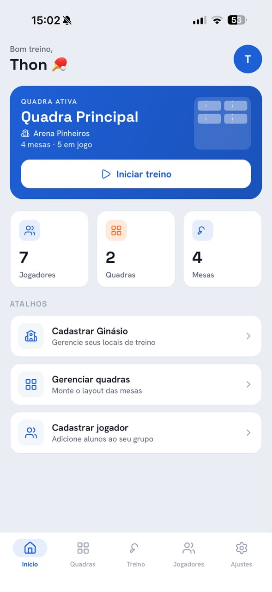
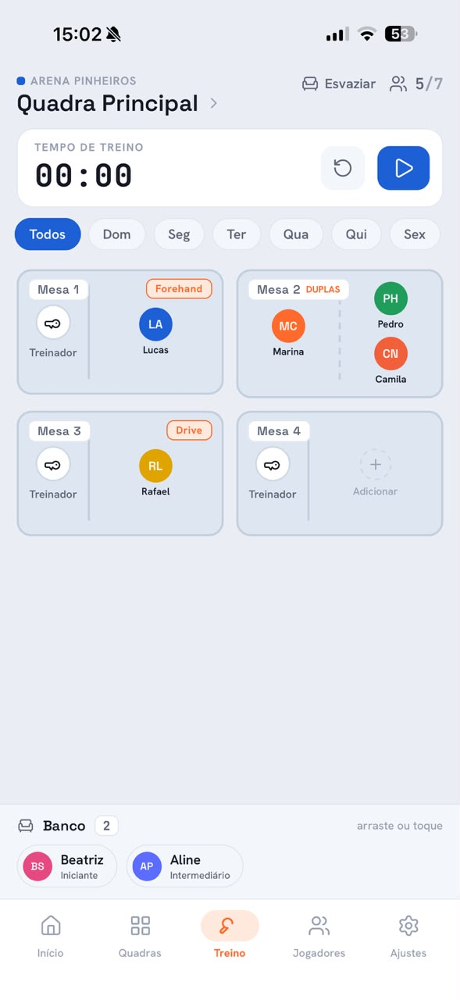
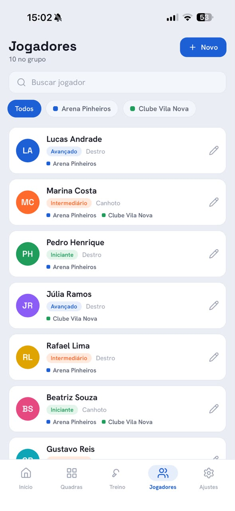
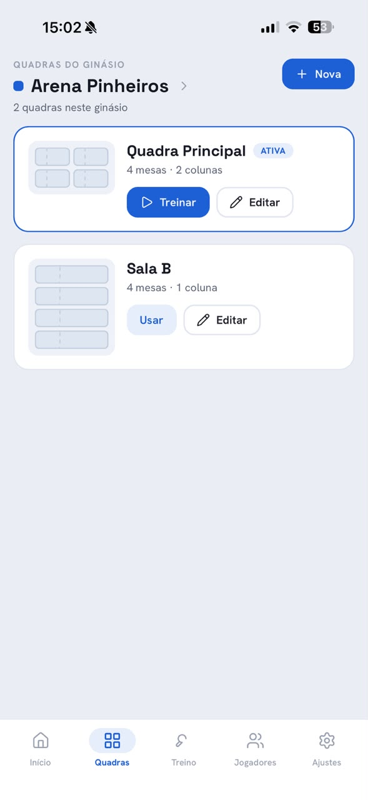
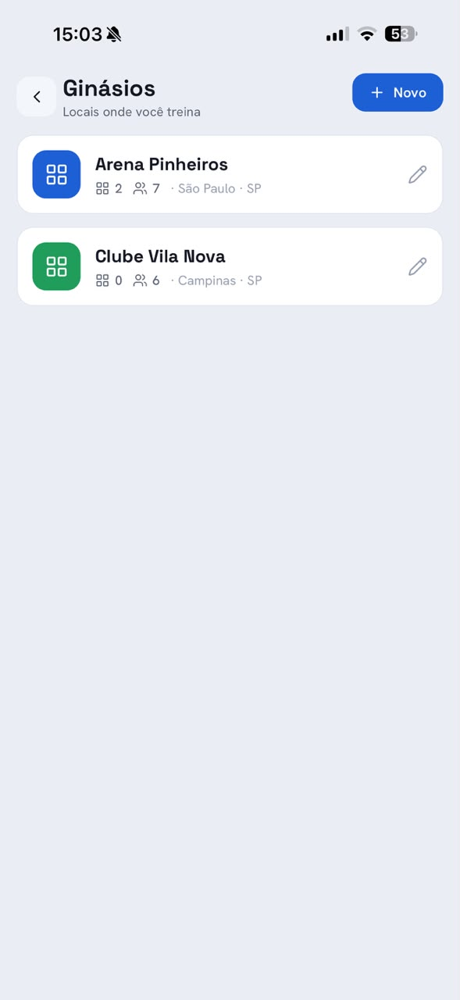
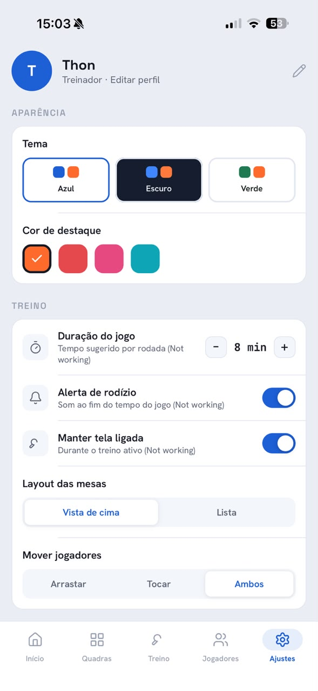

<div align="center">
  <h1>🏓 TT Trainer</h1>
  <p>A mobile app for table tennis coaches to manage venues, courts, players, and training sessions.</p>

  
  
  
  
</div>

---

## 📸 Screenshots

| Home                                | Training                                    | Players                                   |
| ----------------------------------- | ------------------------------------------- | ----------------------------------------- |
|  |  |  |

| Courts                                  | Gyms                                | Settings                                    |
| --------------------------------------- | ----------------------------------- | ------------------------------------------- |
|  |  |  |

---

## 📖 About

**TT Trainer** is a coach-side table tennis management app built for trainers who work at multiple venues. It solves the real-world problem of organizing players across courts, tracking who trains where and when, and managing live training sessions — all from a single mobile app.

### How it works

1. **Set up your venues** — Add gyms with a name, city, and color tag for quick identification.
2. **Configure your courts** — Each gym can have multiple courts. Define how many tables each court has and arrange them in 1–3 column layouts.
3. **Register your players** — Add players with their skill level, playing hand, gym affiliations, and which weekdays they train.
4. **Run a training session** — Open the Training tab, pick a court, and assign players to tables by tapping or dragging. The app enforces capacity rules and prevents a player from being on two tables at once.
5. **Use the timer** — A shared training timer with play/pause/reset keeps your rotations on track.

---

## ✨ Features

### Venues & Courts

- Manage multiple gyms, each with a custom color and city
- Create courts per gym with configurable 1–3 column table grids
- Set training type tags per table (e.g. "Forehand", "Multiball")

### Players

- Player profiles with skill level (Beginner / Intermediate / Advanced), playing hand, and color avatar
- Assign players to multiple gyms
- Set training weekdays per player for smart session filtering

### Training Session

- Live table canvas with two-sided layout — **coach side** and **player side**
- **Drag-and-drop** or **tap** assignment modes (configurable)
- Doubles format (2×2) or training format (1×N) per table
- Weekday filter to show only players scheduled for the current day
- One-seat rule: a player can only be on one table at a time
- Available players bench at the bottom

### Timer

- Shared countdown timer across all tables
- Play / pause / reset with configurable default duration

### Theming & Customization

- 3 built-in themes: **Blue & Orange** (light), **Dark Sport** (dark), **Green Table** (light)
- 4 accent color options: Orange, Red, Magenta, Cyan
- Persistent settings saved locally

---

## 🛠 Tech Stack

| Layer      | Technology                                                                               |
| ---------- | ---------------------------------------------------------------------------------------- |
| Framework  | [React Native](https://reactnative.dev/) 0.81 + [Expo](https://expo.dev/) 54             |
| Routing    | [Expo Router](https://expo.github.io/router/) (file-based, tab + stack)                  |
| State      | [Zustand](https://zustand-demo.pmnd.rs/) + AsyncStorage persistence                      |
| Animations | [React Native Reanimated](https://docs.swmansion.com/react-native-reanimated/) 4         |
| Gestures   | [React Native Gesture Handler](https://docs.swmansion.com/react-native-gesture-handler/) |
| Icons      | [Lucide React Native](https://lucide.dev/)                                               |
| Fonts      | Space Grotesk · Hanken Grotesk · JetBrains Mono (via Expo Google Fonts)                  |
| Language   | TypeScript 5.9                                                                           |
| Build      | [EAS Build](https://docs.expo.dev/build/introduction/)                                   |

---

## 🚀 Getting Started

### Prerequisites

- [Node.js](https://nodejs.org/) 18+ (via [nvm](https://github.com/nvm-sh/nvm) recommended)
- [Expo CLI](https://docs.expo.dev/get-started/installation/)
- iOS Simulator (macOS) or Android emulator, or the [Expo Go](https://expo.dev/client) app on your device

> **WSL users:** Run all commands inside WSL. Make sure `nvm` is sourced — add `source ~/.nvm/nvm.sh` to your `.bashrc` / `.zshrc` if needed.

### Installation

```bash
# 1. Clone the repository
git clone https://github.com/your-username/tt-trainer.git
cd tt-trainer

# 2. Install dependencies
npm install

# 3. Start the dev server
npx expo start
```

Press **`i`** to open on iOS Simulator, **`a`** for Android, or **`w`** for the web.

### Running on a physical device

Install **Expo Go** from the App Store or Google Play, then scan the QR code shown by `npx expo start`.

### Building for production

This project uses [EAS Build](https://docs.expo.dev/build/introduction/). Make sure you have an Expo account and EAS CLI installed:

```bash
npm install -g eas-cli
eas login

# Development build (for testing on device without Expo Go)
eas build --profile development --platform android

# Production build
eas build --profile production --platform all
```

---

## 📁 Project Structure

```
tt-trainer/
├── src/
│   ├── app/                  # Expo Router routes
│   │   ├── (tabs)/           # Bottom tab screens
│   │   │   ├── index.tsx     # Home / Dashboard
│   │   │   ├── courts.tsx    # Courts management
│   │   │   ├── training.tsx  # Live training session
│   │   │   ├── players.tsx   # Player list
│   │   │   └── settings.tsx  # App settings
│   │   └── gyms.tsx          # Gyms stack screen
│   ├── features/             # Screen-level components per feature
│   │   ├── home/
│   │   ├── courts/
│   │   ├── training/         # TableTop, Bench, TimerBar, ManageTableSheet
│   │   ├── players/
│   │   ├── gyms/
│   │   └── settings/
│   ├── components/           # Shared UI components (Button, Card, Avatar, ...)
│   ├── store/                # Zustand store, selectors, seed data
│   ├── models/               # TypeScript types & interfaces
│   ├── theme/                # Theme provider, palettes, font tokens
│   └── icons/                # Lucide icon wrappers
├── app.json                  # Expo app configuration
├── eas.json                  # EAS build profiles
└── CLAUDE.md                 # AI assistant instructions
```

---

## 🗺 Roadmap

- [ ] Export session report (PDF / share)
- [ ] Player attendance history
- [ ] Push notifications for rotation alerts
- [ ] Cloud sync / multi-device support
- [ ] Match scoring within session

---

## 📄 License

MIT © [shinjiaki](https://github.com/shinjiaki)
